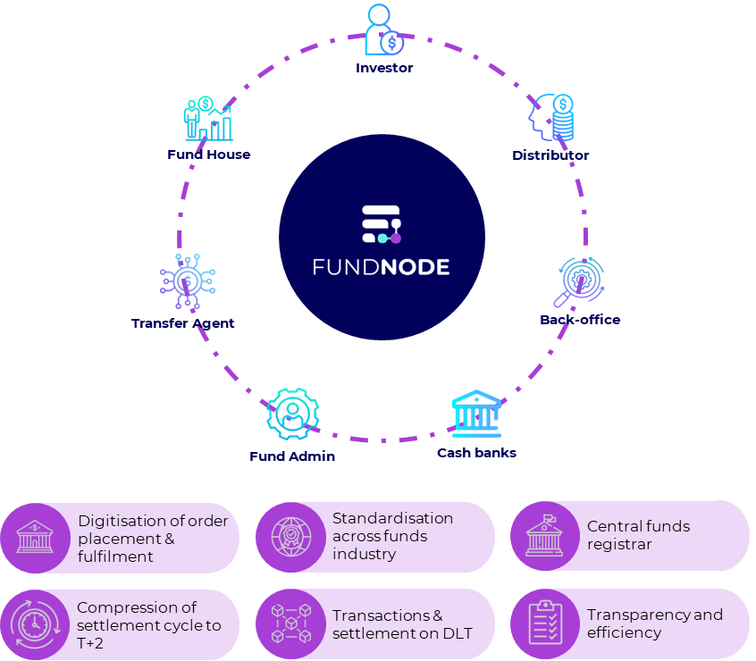
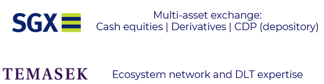

# Introduction 

## Introduction of Fundnode

Fundnode is the catalyst that will reshape the funds management industry.

We are transforming the industry by digitising and standardising fund flows, centralising information exchange, orchestrating cash & units transfer, simplifying settlement value chain, building a single source of truth on fund data, and thus bringing transparency and efficiency to fund investments.

## Who are we?

We are Asia’s first fund settlement platform on Distributed Ledger Technology (DLT) that can connect all participants onto a single ecosystem.

## Pioneering Fund Innovation in Distributed Ledger Technology

We employ the use of next generation technology stack with a focus on efficiency (smart contracts & DLT)

As Asia's pioneer in employing the use Distributed Ledger Technology (DLT) for fund settlement, we can harness the power of blockchain to transform the funds landscape. With the use of DLT, transactions are secure, transparent and immutable.

## All-in-one Ecosystem

We bring together all participants involved in the funds management process. Our platform aims to foster collaboration among distributors, transfer agents, regulators and streamlines operations, so as to open up new possibilities for growth, cost reduction and innovation.

## Our Heritage

## Vision and Mission (Draft)

Our vision is to revolutionise Singapore’s funds industry through the digitisation of information flow and transformation of funds management practices for a more interconnected, efficient and secure future.

Our mission:

1. Digital Transformation: We aim to spearhead the digital transformation of the funds management industry by providing cutting-edge technology solutions that streamline the flow of trades and information, enhancing transparency and accessibility for all stakeholders.
2. Seamless Integration: Our mission is to create a seamless and interconnected ecosystem that fosters collaboration among asset managers, custodians, financial institutions, and regulators. By facilitating real-time data exchange, we empower all participants to make informed decisions and optimize their operations.
3. Empowering Efficiency: Our goal is to enhance the efficiency of funds management processes, reducing manual interventions, and automating repetitive tasks. By doing so, we enable our clients to focus on strategic decision-making and value-adding activities.
4. Global Reach: We envision a globally connected funds landscape. We work relentlessly to expand our network of partners and clients worldwide, facilitating cross-border collaboration and opening up new opportunities for growth and diversification.
5. Sustainability: We recognize the importance of sustainability in the financial industry. As we digitize and transform the funds landscape, we actively promote environmentally responsible practices and advocate for social and ethical responsibility.

